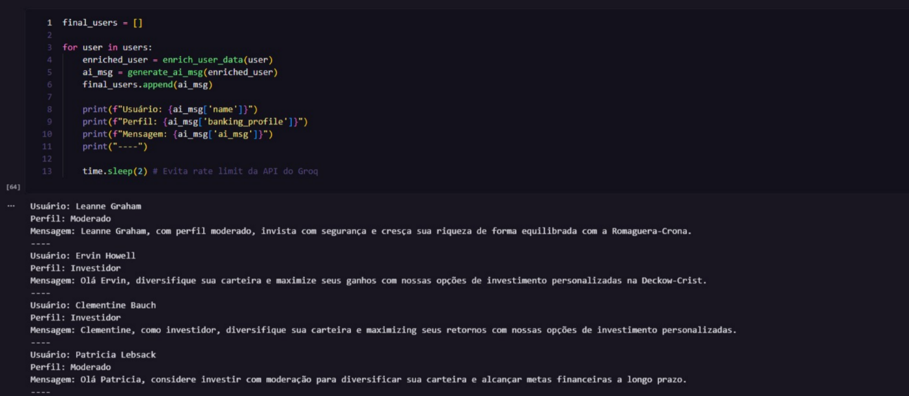
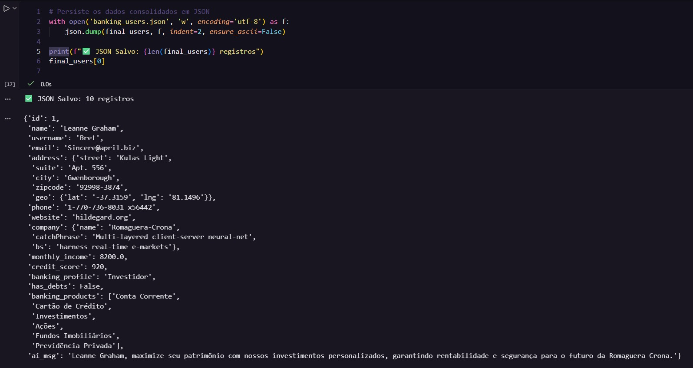
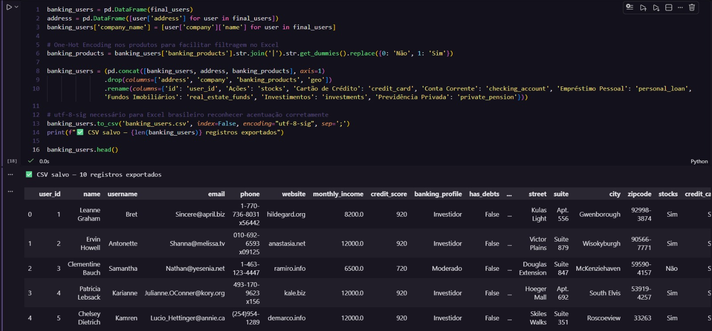
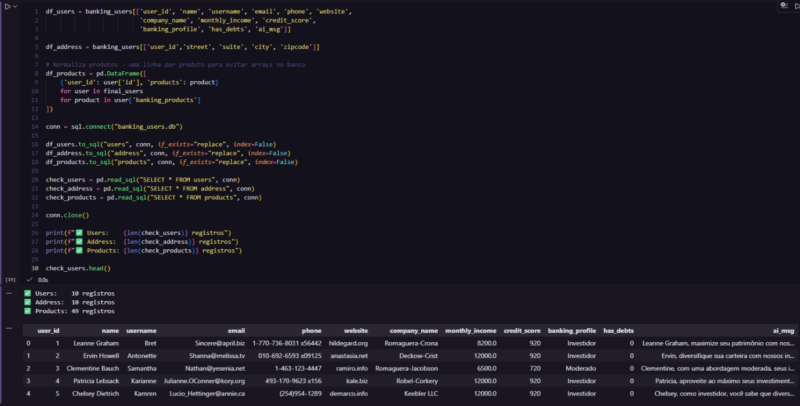

# 🏦 Pipeline ETL com IA Generativa | ETL Pipeline with Generative AI

<div align="center">


</div>

---

## 📋 Sobre o Projeto | About

**PT-BR:** Pipeline ETL completo em Python que extrai dados de usuários de uma API pública, enriquece com perfil bancário fictício gerado por IA Generativa e cria mensagens de marketing personalizadas para cada cliente — persistindo os dados em múltiplos formatos.

**EN:** A complete Python ETL pipeline that extracts user data from a public API, enriches it with AI-generated fictional banking profiles, and creates personalized marketing messages for each client — persisting the data in multiple formats.

---

## 🔄 Fluxo do Pipeline | Pipeline Flow

```
📥 EXTRACT          🔄 TRANSFORM                    💾 LOAD
─────────────   ──────────────────────────────   ──────────────────
API REST      → Enriquecimento com IA         → JSON
JSONPlaceholder  Perfil bancário fictício         CSV (Excel)
IDs via CSV      Score, renda, produtos           SQLite (3 tabelas)
                 ↓
                 Marketing personalizado
                 Mensagem por perfil (IA)
```

---

## ✨ Destaques Técnicos | Technical Highlights

- **Prompt Engineering** estruturado em blocos com regras e faixas de referência para garantir coerência dos dados gerados
- **Programação defensiva** — tratamento da resposta da IA com `re.sub` e `.replace()` para garantir dados limpos independente do comportamento do modelo
- **Normalização relacional** no SQLite — dados persistidos em 3 tabelas relacionadas por `user_id`
- **One-Hot Encoding** nos produtos bancários para facilitar filtragem no Excel
- **Walrus operator** (`:=`) na extração para filtrar usuários não encontrados em uma única linha
- **Segurança** — chave da API protegida via variável de ambiente (`.env`)

---

## 🖥️ Demonstração | Demo

### Pipeline em execução | Pipeline running


### Persistência JSON + dados do primeiro usuário | JSON persistence + first user data


### CSV estruturado com One-Hot Encoding | Structured CSV with One-Hot Encoding


### SQLite normalizado em 3 tabelas | SQLite normalized in 3 tables


---

## 🗂️ Estrutura do Projeto | Project Structure

```
ETL_GenAI/
├── 📓 code.ipynb             # Notebook principal com o pipeline completo
├── 📄 users_id.csv           # IDs dos usuários para extração
├── 📦 banking_users.json     # Saída — dados consolidados
├── 📊 banking_users.csv      # Saída — dados estruturados para análise
├── 🗄️  banking_users.db      # Saída — banco de dados SQLite
├── 📋 requirements.txt       # Dependências do projeto
├── 🔒 .env                   # Chave da API (não versionado)
└── 📖 README.md
```

---

## 🛠️ Tecnologias | Technologies

| Tecnologia | Uso |
|---|---|
| **Python 3.12** | Linguagem principal |
| **Groq API + LLaMA 3.3-70b** | IA Generativa para enriquecimento e marketing |
| **Pandas** | Manipulação e estruturação de dados |
| **SQLite** | Persistência relacional normalizada |
| **JSONPlaceholder** | API pública de dados fictícios |
| **python-dotenv** | Gerenciamento seguro de variáveis de ambiente |

---

## 🚀 Como Executar | How to Run

### Pré-requisitos | Prerequisites
- Python 3.12+
- Conta gratuita na [Groq](https://console.groq.com) para obter a API Key

### Passo a passo | Step by step

**1. Clone o repositório | Clone the repository**
```bash
git clone https://github.com/Gustavo-Lennert/etl-genai-pipeline.git
cd etl-genai-pipeline
```

**2. Crie e ative o ambiente virtual | Create and activate virtual environment**
```bash
python -m venv .venv

# Windows
.venv\Scripts\activate

# Linux/Mac
source .venv/bin/activate
```

**3. Instale as dependências | Install dependencies**
```bash
pip install -r requirements.txt
```

**4. Configure a chave da API | Configure the API key**

Crie um arquivo `.env` na raiz do projeto com o conteúdo:
```
GROQ_API_KEY=sua_chave_aqui
```
Obtenha sua chave gratuita em: [console.groq.com](https://console.groq.com)

**5. Execute o notebook | Run the notebook**

Abra e execute o arquivo `code.ipynb` no Jupyter Notebook ou VS Code.

---

## 📊 Saídas Geradas | Generated Outputs

| Arquivo | Formato | Descrição |
|---|---|---|
| `banking_users.json` | JSON | Dados consolidados — ideal para consumo por APIs |
| `banking_users.csv` | CSV | Dados estruturados com One-Hot Encoding — para Excel/Power BI |
| `banking_users.db` | SQLite | Banco relacional normalizado em 3 tabelas (`users`, `address`, `products`) |

---

## 👤 Autor | Author

**Gustavo Lennert**

[](https://github.com/Gustavo-Lennert)

---

<div align="center">
  <sub>Desenvolvido como projeto de portfólio pessoal | Developed as a personal portfolio project</sub>
</div>
